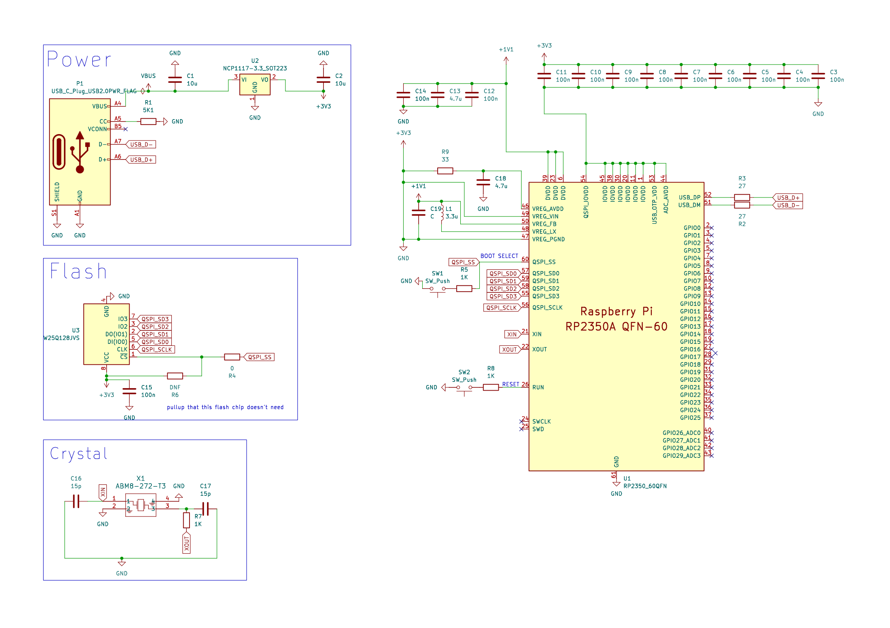

# 25/07 Made the minimal schematic
I created the base schematic for the RP2350 with help from the [hardware design guide](https://datasheets.raspberrypi.com/rp2350/hardware-design-with-rp2350.pdf). It includes a power supply using usb-c, flash memory (16 MB), and an external crystal. These are all of the components needed to minimally use the RP2350 chip and without them, it would not function.   

Next, I will have to pick a firmware to use and add the necessary changes (eg pins for nfc) to the schematic.

### **Schematic:**

**Total time spent: 3h**
